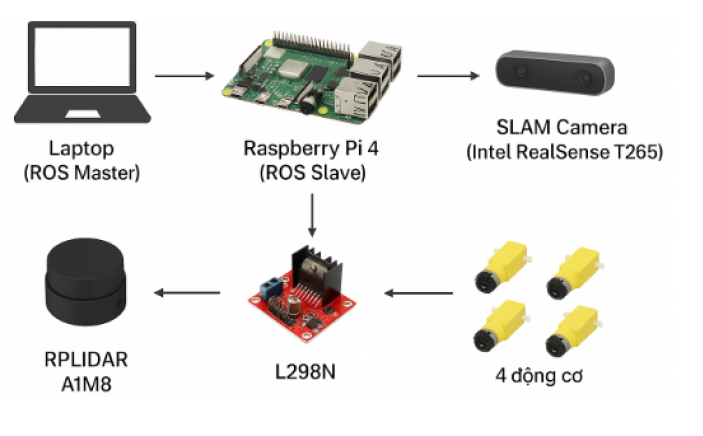
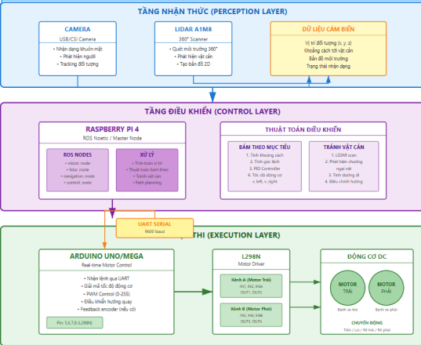

<h1 align="center">HỆ THỐNG ROBOT NHẬN DIỆN VÀ THEO DÕI KHUÔN MẶT</h1>

<div align="center">

<p align="center">
  
  
</p>

[](https://www.facebook.com/DNUAIoTLab)
[](https://fitdnu.net/)
[](https://dainam.edu.vn)

</div>

<h2 align="center">Robot tự động nhận diện và theo dõi chủ nhân sử dụng AI</h2>

<p align="left">
  Dự án này tập trung vào việc xây dựng một hệ thống robot thông minh có khả năng nhận diện khuôn mặt và tự động theo dõi chủ nhân. Bằng cách kết hợp Computer Vision, Machine Learning và Arduino, robot có thể phát hiện, nhận diện người dùng và duy trì khoảng cách an toàn khi di chuyển theo.
</p>

---

## 🌟 Giới thiệu

- **📷 Thu thập dữ liệu khuôn mặt:** Sử dụng camera để chụp và lưu trữ hình ảnh khuôn mặt của người dùng.
- **🤖 Nhận diện bằng AI:** Ứng dụng thuật toán LBPH (Local Binary Patterns Histograms) để nhận diện chính xác khuôn mặt.
- **🎯 Theo dõi tự động:** Robot tự động xoay và di chuyển để giữ chủ nhân trong tầm nhìn với khoảng cách an toàn.
- **📡 Điều khiển Arduino:** Giao tiếp serial với Arduino để điều khiển động cơ và các thiết bị di chuyển.
- **📊 Tính toán khoảng cách:** Ước lượng khoảng cách thực tế dựa trên kích thước khuôn mặt trong ảnh.

---

## 🏗️ HỆ THỐNG

<p align="center">
  
</p>

---

## 📦 Cấu trúc Dự án

```
📦 Face Recognition Robot
├── 📁 dataset                    # Chứa ảnh khuôn mặt đã thu thập
│   ├── TenNguoi.1.jpg
│   ├── TenNguoi.2.jpg
│   └── ...
│
├── 📁 trainer                    # Chứa mô hình đã huấn luyện
│   ├── trainer.yml               # Mô hình LBPH đã lưu
│   └── names.npy                 # Ánh xạ ID và tên người dùng
│
├── 📁 logo                       # Hình ảnh logo và minh họa
│
├── face_dataset.py               # Thu thập dữ liệu khuôn mặt
│
├── face_training.py              # Huấn luyện mô hình nhận diện
│
├── follow_owner.py               # Chương trình chính điều khiển robot
│
├── haarcascade_frontalface_default.xml  # Bộ phát hiện khuôn mặt Haar Cascade
│
├── Test.jpg                      # Ảnh mẫu để hiệu chuẩn khoảng cách
│
├── .gitignore                    # Danh sách file cần bỏ qua khi push lên Git
│
└── README.md                     # Tài liệu hướng dẫn dự án
```

---

## 🛠️ CÔNG NGHỆ SỬ DỤNG

<div align="center">

### 🔌 Phần cứng
[](https://www.arduino.cc/)
[]()
[]()
[]()
[]()

### 🖥️ Phần mềm
[](https://www.python.org/)
[](https://opencv.org/)
[](https://numpy.org/)
[](https://pyserial.readthedocs.io/)

</div>

---

## 🛠️ YÊU CẦU HỆ THỐNG

### 🔌 Phần cứng
- **Arduino Uno/Mega** để điều khiển động cơ và nhận lệnh từ máy tính.
- **USB Camera/Webcam** để chụp ảnh và phát hiện khuôn mặt.
- **Motor Driver L298N** để điều khiển động cơ DC.
- **Động cơ DC** (2-4 động cơ) để di chuyển robot.
- **Khung robot** với bánh xe và nguồn điện (pin hoặc adapter).
- **Cáp USB** để kết nối Arduino với máy tính.

### 💻 Phần mềm
- **🐍 Python 3.7+** 
- **📷 OpenCV 4.x** để xử lý ảnh và nhận diện khuôn mặt.
- **🔢 NumPy** để xử lý dữ liệu số.
- **📡 PySerial** để giao tiếp với Arduino.
- **🖼️ Pillow (PIL)** để xử lý ảnh.

---

## 📦 CÁC THƯ VIỆN PYTHON CẦN THIẾT

Để chạy dự án, bạn cần cài đặt các thư viện sau bằng lệnh:

```bash
pip install opencv-python opencv-contrib-python numpy pillow pyserial
```

**Lưu ý:** Module `cv2.face` chỉ có trong `opencv-contrib-python`, không có trong `opencv-python` thông thường.

---

## 📖 HƯỚNG DẪN SỬ DỤNG

### 🔧 Bước 1: Chuẩn bị phần cứng

1️⃣ **Lắp ráp robot:**
   - Kết nối động cơ DC với Motor Driver L298N
   - Kết nối Motor Driver với Arduino (IN1, IN2, IN3, IN4)
   - Cấp nguồn cho Arduino và Motor Driver
   - Lắp camera lên phần đầu robot

2️⃣ **Upload code Arduino:**
   ```cpp
   // Code Arduino điều khiển động cơ
   void setup() {
     Serial.begin(9600);
     pinMode(IN1, OUTPUT);
     pinMode(IN2, OUTPUT);
     pinMode(IN3, OUTPUT);
     pinMode(IN4, OUTPUT);
   }
   
   void loop() {
     if (Serial.available() > 0) {
       char cmd = Serial.read();
       switch(cmd) {
         case 'F': moveForward(); break;
         case 'B': moveBackward(); break;
         case 'L': turnLeft(); break;
         case 'R': turnRight(); break;
         case 'S': stop(); break;
       }
     }
   }
   ```

3️⃣ **Kết nối:**
   - Kết nối Arduino với máy tính qua cáp USB
   - Kiểm tra COM port (Windows) hoặc /dev/ttyUSB (Linux)
   - Cập nhật `ARDUINO_PORT` trong file `follow_owner.py`

---

### 📷 Bước 2: Thu thập dữ liệu khuôn mặt

Chạy chương trình thu thập dữ liệu:

```bash
python face_dataset.py
```

**Hướng dẫn:**
- Nhập tên người cần nhận diện
- Nhìn thẳng vào camera
- Chương trình sẽ tự động chụp 200 ảnh khuôn mặt
- Ảnh được lưu trong thư mục `dataset/`
- Nhấn **ESC** để dừng sớm

**💡 Mẹo để có dữ liệu tốt:**
- Chụp ở nhiều góc độ khác nhau
- Thay đổi ánh sáng (sáng/tối)
- Thử nhiều biểu cảm khuôn mặt
- Đảm bảo khuôn mặt rõ ràng và không bị che

---

### 🎓 Bước 3: Huấn luyện mô hình

Sau khi thu thập đủ dữ liệu, chạy:

```bash
python face_training.py
```

**Quá trình:**
- Tự động đọc tất cả ảnh trong thư mục `dataset/`
- Phát hiện và trích xuất đặc trưng khuôn mặt
- Huấn luyện mô hình LBPH
- Lưu mô hình vào `trainer/trainer.yml`
- Lưu ánh xạ tên vào `trainer/names.npy`

---

### 🤖 Bước 4: Chạy robot theo dõi

#### 4️⃣.1 **Hiệu chuẩn khoảng cách (Tùy chọn):**

Chụp một ảnh mẫu với khuôn mặt ở khoảng cách 45cm và lưu thành `Test.jpg`. Điều này giúp robot ước lượng khoảng cách chính xác hơn.

#### 4️⃣.2 **Khởi động hệ thống:**

```bash
python follow_owner.py
```

**Hệ thống sẽ:**
- ✅ Kết nối với Arduino
- ✅ Load mô hình nhận diện
- ✅ Khởi động camera
- ✅ Hiệu chuẩn khoảng cách
- ✅ Bắt đầu theo dõi

#### 4️⃣.3 **Chế độ hoạt động:**

🎯 **Nhận diện:**
- Robot phát hiện và nhận diện khuôn mặt trong khung hình
- Chỉ theo dõi người đã được huấn luyện (confidence > 60%)
- Hiển thị tên, độ tin cậy và khoảng cách trên màn hình

🚗 **Điều khiển tự động:**
- **Xoay trái (L):** Khi khuôn mặt ở bên trái màn hình
- **Xoay phải (R):** Khi khuôn mặt ở bên phải màn hình  
- **Tiến (F):** Khi khoảng cách > 60cm
- **Lùi (B):** Khi khoảng cách < 40cm
- **Dừng (S):** Khi ở khoảng cách an toàn (40-60cm) hoặc không phát hiện

---

## ⚙️ CẤU HÌNH HỆ THỐNG

Chỉnh sửa các thông số trong file `follow_owner.py`:

```python
# Cổng kết nối Arduino
ARDUINO_PORT = 'COM6'        # Windows: 'COM3', 'COM4',...
                             # Linux: '/dev/ttyUSB0'
ARDUINO_BAUD = 9600

# Kích thước camera
CAMERA_WIDTH = 640
CAMERA_HEIGHT = 480

# Khoảng cách an toàn (cm)
SAFE_MIN = 40               # Khoảng cách tối thiểu
SAFE_MAX = 60               # Khoảng cách tối đa

# Vùng chết giữa màn hình (tránh dao động)
CENTER_DEAD_ZONE = 80       # Pixel

# Ngưỡng confidence để nhận diện
CONFIDENCE_THRESHOLD = 60   # 0-100 (càng thấp càng chặt)

# Hiệu chuẩn khoảng cách
FACE_REAL_WIDTH = 19        # Chiều rộng khuôn mặt thực (cm)
CALIBRATION_DISTANCE = 45   # Khoảng cách hiệu chuẩn (cm)
```

---

## 🎮 ĐIỀU KHIỂN

### Phím tắt:
- **ESC** - Thoát chương trình
- Hệ thống tự động gửi lệnh đến Arduino:
  - `F` - Forward (Tiến)
  - `B` - Backward (Lùi)
  - `L` - Left (Xoay trái)
  - `R` - Right (Xoay phải)
  - `S` - Stop (Dừng)

---

## 📊 GIẢI THÍCH THUẬT TOÁN

### 🔍 Phát hiện khuôn mặt:
- Sử dụng **Haar Cascade Classifier** để phát hiện khuôn mặt nhanh
- Xử lý ảnh grayscale để tăng tốc độ

### 🧠 Nhận diện khuôn mặt:
- Thuật toán **LBPH (Local Binary Patterns Histograms)**:
  - Chia khuôn mặt thành các vùng nhỏ
  - Trích xuất texture patterns cục bộ
  - So sánh histogram để nhận diện
  - Độ chính xác cao với dữ liệu huấn luyện tốt

### 📏 Tính khoảng cách:
```
Distance = (FACE_REAL_WIDTH × CALIBRATION_DISTANCE) / face_width_in_pixels
```

### 🎯 Điều khiển:
1. **Ưu tiên xoay:** Đảm bảo khuôn mặt ở giữa màn hình
2. **Sau đó điều chỉnh khoảng cách:** Tiến/lùi để duy trì khoảng cách an toàn
3. **Debouncing:** Tránh gửi lệnh liên tục gây dao động

## 🚀 TÍNH NĂNG MỞ RỘNG

- [ ] **Multi-face tracking:** Theo dõi nhiều người cùng lúc
- [ ] **Voice control:** Điều khiển bằng giọng nói
- [ ] **Obstacle avoidance:** Tránh vật cản bằng cảm biến siêu âm
- [ ] **Autonomous navigation:** Di chuyển tự động trong không gian
- [ ] **Cloud logging:** Lưu trữ dữ liệu trên cloud
- [ ] **Mobile app:** Điều khiển và giám sát qua smartphone
- [ ] **Deep Learning:** Sử dụng CNN để nhận diện chính xác hơn

---

## 📰 Poster

<p align="center">
  
</p>


© 2025 NHÓM 23, CNTT 16-02, TRƯỜNG ĐẠI HỌC ĐẠI NAM

---

## 📞 Liên hệ

- 🌐 Website: [https://dainam.edu.vn](https://dainam.edu.vn)
- 📧 Email: [email@dainam.edu.vn](mailto:email@dainam.edu.vn)
- 📱 Facebook: [AIoTLab](https://www.facebook.com/DNUAIoTLab)

---

<div align="center">

**⭐ Nếu thấy dự án hữu ích, hãy cho chúng tôi một ngôi sao! ⭐**

Made with ❤️ by AIoTLab Team

</div>
